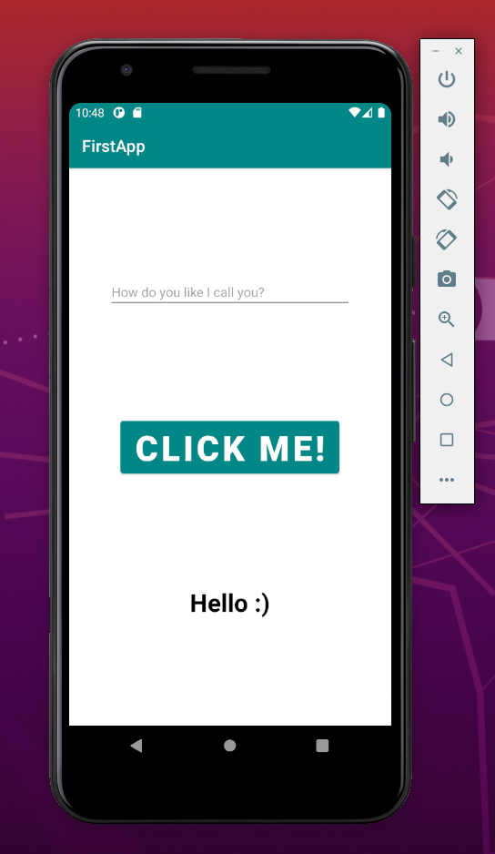
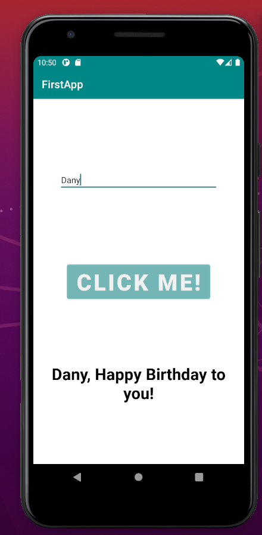

# kotlin-first-app

## Birthday Message

This is a simple app, that allows you to congratulate someone on their birthday.

You just type the name of the person you press the button "Click me" and you will see a customized message

## Pictures

